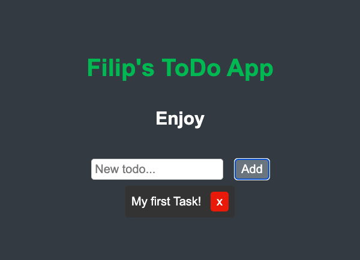

# React ToDo App
https://todoapp-18158.web.app/
This is a simple ToDo application built with React and Firebase. It lets you add, delete, and mark tasks as completed.

## Getting Started

### Prerequisites

To run this application, you'll need:

- Node.js and npm installed on your machine.
- A Firebase account to deploy the application.

### Installation

1. Clone the repository:

git clone https://github.com/FilipFilchev/ReactToDoApp.git

2. Navigate to the project directory:

cd ReactToDoApp

3. Install the dependencies:

npm install
Starting the Development Server
To start the development server, run:

npm start
Then open http://localhost:3000 to view it in the browser.

4. Deploying to Firebase
Install Firebase CLI globally:

npm install -g firebase-tools

- Login to Firebase:

firebase login

- Build your React app:

npm run build

- Initialize Firebase in your project:

firebase init

- Choose "Hosting" when prompted, select your Firebase project, set "build" as your public directory, and configure as a single-page app.

- Deploy your app to Firebase:

firebase deploy
Your app is now live! You can view it at https://your-app-id.firebaseapp.com

## Built With
React - JavaScript library for building user interfaces
Firebase - Comprehensive mobile development platform

# Authors
Filip Filchev - Simple_ToDoApp 
